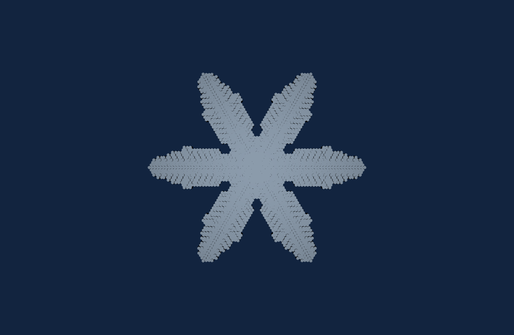
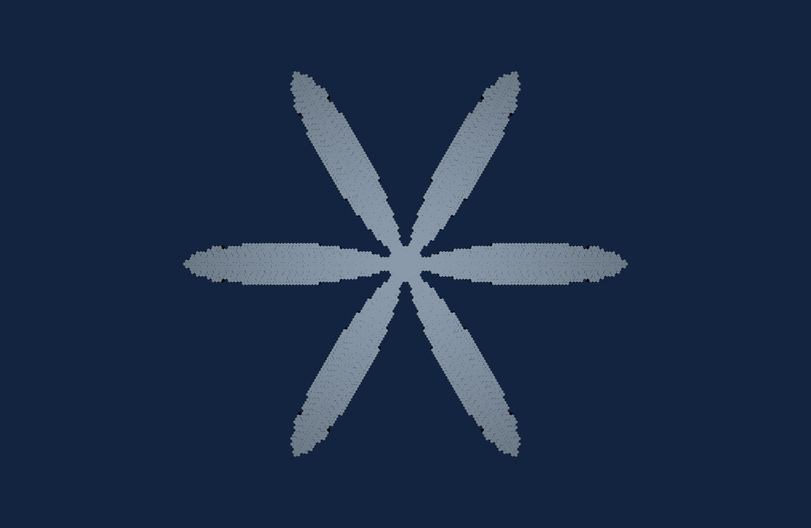
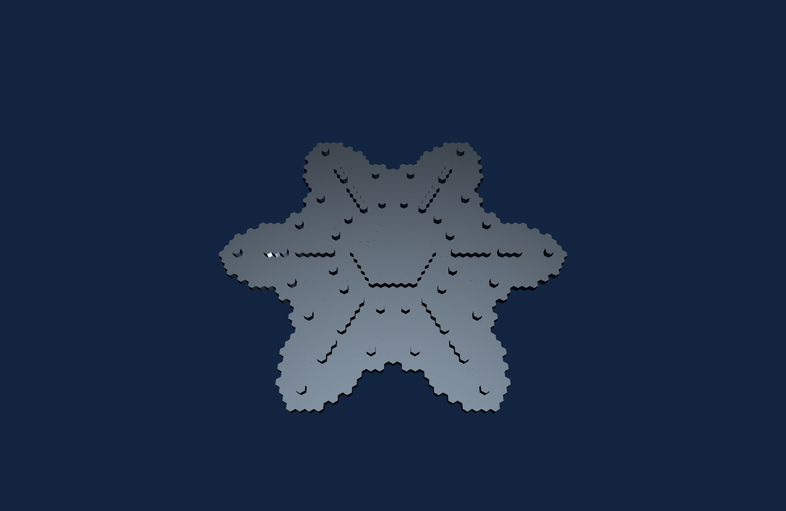
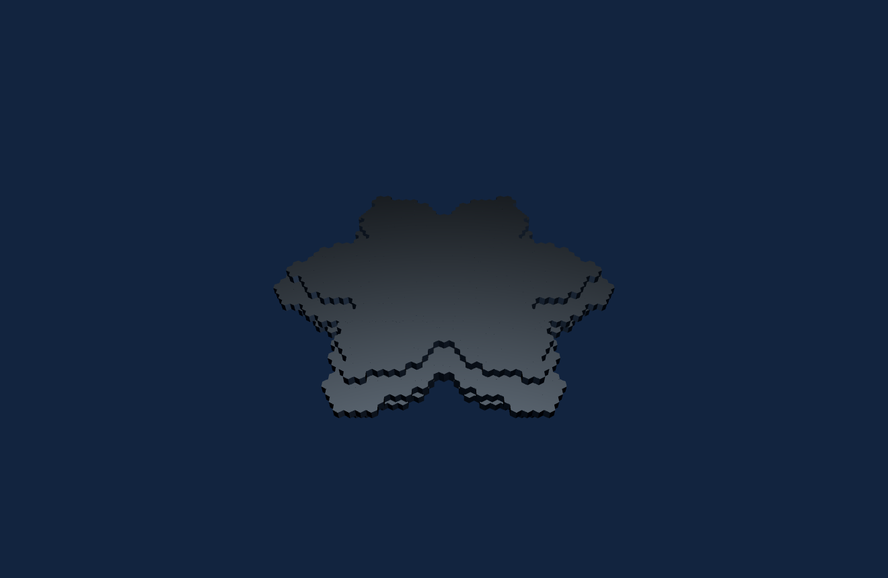
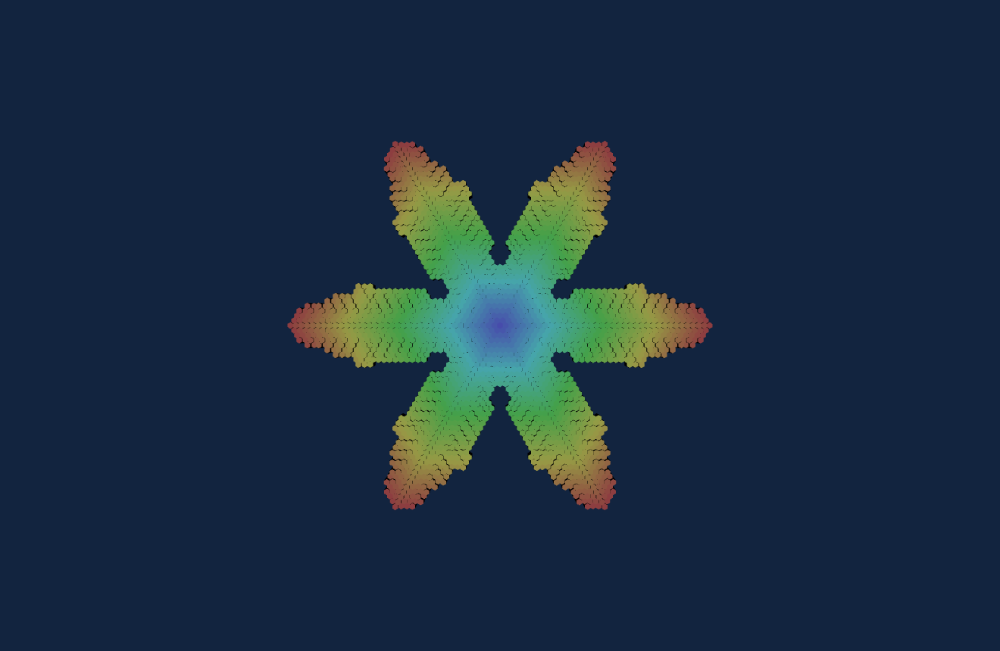

# Snowflake 3D

[](https://github.com/nanamitm/snowflake3d/actions/workflows/release.yml)

雪の結晶の成長をセルオートマトンでシミュレーションし、**Qt Quick 3D** で任意方向から観察できるデスクトップアプリです。2.5D の高さフィールドと、完全 3D のボクセル結晶の両方に対応します。

[necocen/snowflake](https://github.com/necocen/snowflake)（Rust + Bevy）にインスパイアされた、Qt6 / C++ による独立実装です。



| 2D 樹枝 (fern) | 3D 樹枝 | 3D 厚板樹枝 |
|:---:|:---:|:---:|
|  |  |  |

中心からの成長履歴をスペクトル配色で可視化（Color: Spectrum）:



---

## 特徴

- **2 つの成長モデル**（実行時に切替）
  - **Reiter (2005)** — 局所セルオートマトン
  - **Gravner-Griffeath (2008)** — 拡散律速の中規模モデル（樹枝状の枝分かれ）
- **2.5D 表示** — 2D 六角格子の結晶を厚み付き 3D メッシュ化し、任意方向から観察
- **完全 3D 表示** — 六角プリズム格子上の 3 次元 CA（Reiter3D / Gravner-Griffeath 3D）
  - `thickness` で板厚（層数）を直接制御
  - D6h 厳密対称化により大サイズでも 6 回対称 + 鏡映対称を維持
- **氷マテリアル + IBL** — 透過屈折・クリアコート・手続き生成のスタジオ環境マップ
- **プリセット** — Simple plate / Sectored plate / Stellar dendrite / Fernlike など
- **初期条件（シード）** — Point / Hexagon / Ring / Star(6 腕) ＋ サイズ調整
- **格子の自動拡張** — 結晶が端に達したら格子を広げて成長を継続（状態保持）
- **配色** — Ice（単色）/ Spectrum（中心からの放射状レインボー）/ Thickness（厚み・層）
- **エクスポート** — STL（3D プリント）/ PNG / パラメータ JSON 保存・読込
- **OpenMP 並列化** — シミュレーションのステップを並列実行（8 スレッドで約 3.5 倍）

---

## 必要環境

- **Qt 6.5 以上**（Quick / Quick3D / QuickControls2）
- **C++17** 対応コンパイラ（MSVC 2022 / MinGW / Clang）
- **CMake 3.21 以上**
- **OpenMP**（任意・あれば自動で並列化）

開発・検証は Windows 11 + Qt 6.11.1 + MinGW 13 で実施。

---

## ダウンロード（リリース）

[Releases](https://github.com/nanamitm/snowflake3d/releases) からビルド済みバイナリを入手できます。

- **Windows**: `Snowflake3D-windows-x64.zip`（展開して `Snowflake3D.exe` を実行）
- **Linux**: `Snowflake3D-linux-x86_64.AppImage`（実行権限を付けて起動）

リリースは `vX.Y.Z` 形式のタグを push すると GitHub Actions が自動でビルド・添付します
（`.github/workflows/release.yml`）。

---

## ビルド

### Qt Creator
`CMakeLists.txt` を開いてキットを選び、ビルド・実行するだけです。

### コマンドライン（MinGW 例）
```powershell
# 環境に合わせて Qt のパスを調整してください
$env:Path = "C:\Qt\Tools\CMake_64\bin;C:\Qt\Tools\Ninja;C:\Qt\Tools\mingw1310_64\bin;C:\Qt\6.11.1\mingw_64\bin;" + $env:Path

cmake -S . -B build -G Ninja `
  -DCMAKE_BUILD_TYPE=Release `
  -DCMAKE_PREFIX_PATH="C:/Qt/6.11.1/mingw_64" `
  -DCMAKE_CXX_COMPILER="C:/Qt/Tools/mingw1310_64/bin/g++.exe"

cmake --build build
./build/Snowflake3D.exe
```
`scripts/build.ps1` も参照してください。

---

## 使い方

- **ドラッグ** = 回転 / **ホイール** = ズーム（任意方向から観察）
- 左パネル上部の **「完全 3D 表示へ →」** で 2D / 3D を切替
- **Model** で成長モデルを選択、**Presets** で形状を一発設定、**Play** で成長開始
- スライダで蒸気密度・付着閾値・板厚などを調整
- **Export STL / Save PNG / Save Config / Load Config** で保存

---

## プロジェクト構成

```
snowflake3d/
├── CMakeLists.txt
├── README.md / LICENSE / .gitignore
├── src/
│   ├── main.cpp                       # エントリ。QML 登録・IBL プロバイダ登録
│   ├── EnvProvider.h                  # 手続き生成のスタジオ環境マップ(IBL)
│   ├── SimController.{h,cpp}           # 2D シミュレーション駆動・パラメータ公開・エクスポート
│   ├── SnowflakeGeometry.{h,cpp}      # 2.5D 結晶メッシュ(QQuick3DGeometry)
│   ├── MeshBuilder.h                   # 六角柱メッシュ生成(GPU/STL 共有)
│   ├── Sim3DController.{h,cpp}         # 3D シミュレーション駆動
│   ├── Voxel3DGeometry.{h,cpp}        # 3D ボクセル結晶メッシュ(面カリング)
│   └── core/                           # ★ Qt 非依存のシミュレーションコア
│       ├── CrystalModel.h              # 2D 抽象基底 + 六角格子土台
│       ├── ReiterModel.{h,cpp}         # Reiter (2005) 2D
│       ├── GravnerGriffeathModel.{h,cpp} # Gravner-Griffeath (2008) 2D
│       ├── Crystal3DModel.h            # 3D 抽象基底 + 六角プリズム格子 + D6h 対称化
│       ├── Reiter3DModel.{h,cpp}       # 3D Reiter(板状)
│       └── GravnerGriffeath3DModel.{h,cpp} # 3D GG(樹枝状)
├── qml/
│   └── Main.qml                        # UI と 3D ビュー
├── tests/
│   └── test_core.cpp                   # コアのヘッドレス検証(成長・対称性・メッシュ削減)
└── scripts/
    ├── build.ps1                       # ビルド補助
    └── run-tests.ps1                   # コアテストのビルド・実行
```

`src/core/` は Qt に依存しない純 C++ で、ユニットテストや別フロントエンドへの移植が容易です。

---

## シミュレーションモデル

| モデル | 次元 | 特徴 |
|---|---|---|
| Reiter (2005) | 2D / 3D | 局所セルオートマトン。安定して六角結晶が育つ |
| Gravner-Griffeath (2008) | 2D / 3D | 拡散→凍結→付着→融解。樹枝状の枝分かれを再現 |

3D GG では面内 6 近傍に GG の付着規則を効かせて枝分かれを生み、垂直方向の核形成を中心 `±thickness/2` の窓に制限することで「薄い板の上に伸びる星形樹枝」を作ります。樹枝成長の不安定性が浮動小数点和の順序差を増幅して生じる微小な非対称は、各ステップの D6h 対称化（正準代表のブロードキャスト）で打ち消しています。

---

## テスト

`tests/test_core.cpp` は Qt 非依存のコアを検証します（成長量・6 回対称性・メッシュ削減率）。
`scripts/run-tests.ps1` でビルド・実行できます。

## スクリーンショット生成

アプリは `--shot` キャプチャモードを備えており、決まった形状を再現可能に書き出せます。
```
Snowflake3D --shot out.png [--mode 2d|3d] [--model 0|1] [--preset N]
                           [--steps K] [--tilt deg] [--cam dist] [--color 0|1|2]
```
README 用の一式は `scripts/generate-docs.ps1` で生成します。

---

## クレジット / 参考文献

- インスピレーション元: [necocen/snowflake](https://github.com/necocen/snowflake)（MIT License）
- C. A. Reiter, *"A local cellular model for snow crystal growth"*, Chaos, Solitons & Fractals (2005)
- J. Gravner, D. Griffeath, *"Modeling snow crystal growth II: A mesoscopic lattice map with plausible dynamics"*, Physica D (2008)

---

## ライセンス

[MIT License](LICENSE)
